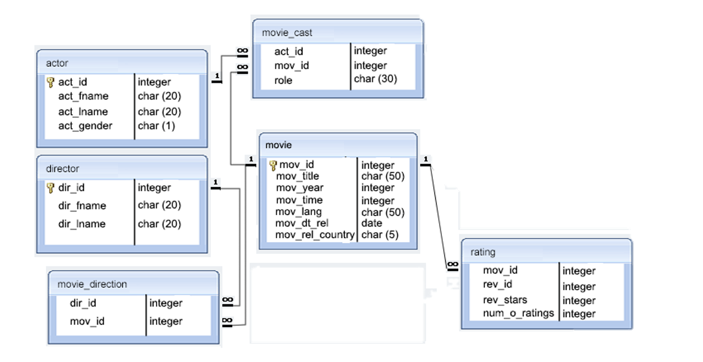

# SQL Part2 lab

* Create database called `movies`
* Excute the  codes in `movies-database.sql` file to create and fill the tables of the database 
* Then answer the following questions:  

    1. write a SQL query to find the movies with ID 905 or 907 or 917. Return movie title.

    2. write a SQL query to find the actors who were cast in the movie 'Annie Hall'. Return actor first name, last name and role. 

    3. write a SQL query to find the actors who have not acted in any movie between 1990 and 2000. Return actor first name, last name, movie title and release year.

    4. write a SQL query to find those years when a movie received a rating of 3 or 4. Sort the result in increasing order on movie year. Return move year. 

    5. write a SQL query to find those movie titles, which include the words 'Boogie Nights'. Sort the result-set in ascending order by movie year. Return movie ID, movie title and movie release year.

    6. write a SQL query to find those movies, which have received ratings. Return movie title, director first name, director last name and review stars.

    7. write a SQL query to find the highest-rated movies. Return movie title, movie year, review stars and releasing country. 

    8. write a SQL query to find the movies with ID 905 or 907 or 917. Return movie title.

    9. write a SQL query to find the movies without any rating. Return movie title.

    10. write a SQL query to find those movies, which was made before 1998. Return movie title. 

you can use the next ERD to make it easer to read the data:

